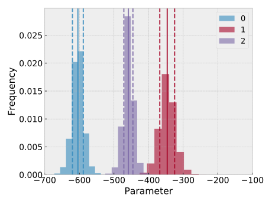
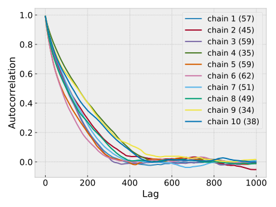
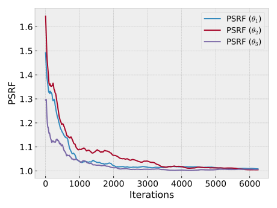
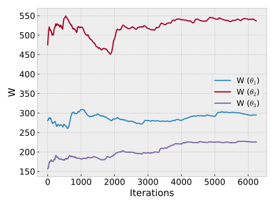
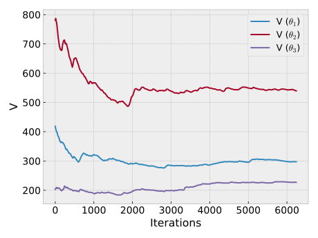

## HitDIC project for fcc NiAlTa

This tutorial will get you through the usage of the module for uncertainty quantification in HitDIC.

Report file is available in `.report/index.html`. One might open this file with browser.

Currently, the HitDIC report can not be generated with toolkit in HitDIC. For personal support please refer to the developer for help.

### Quick start
Custom `optimize.input` as 
```
[mcmc]
bounds = (default, -350, 0);
maxiter = 20000;
chainnumber = 10;
alpha = 0.45;
```
Activate the MCMC module,
```
hitdic-mcmc
```

### Results
#### Histogram



#### Autocorelation



#### Potential reduction scale factor



#### Within-sequence-variance



#### Between-sequence-variance

