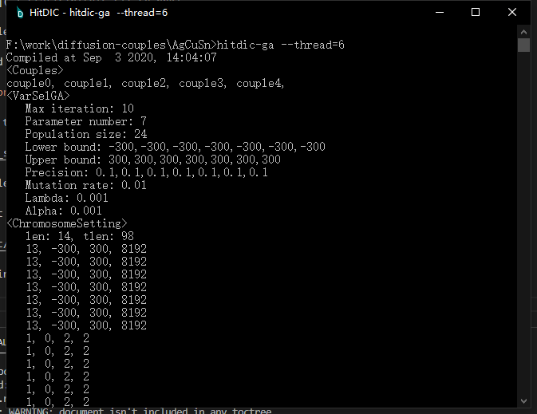
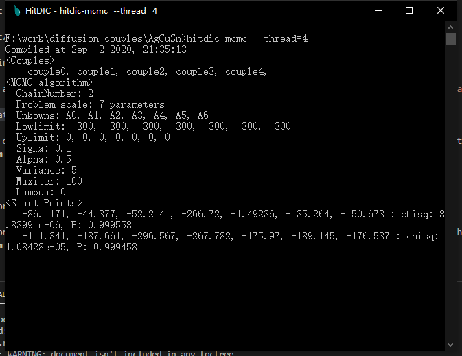

# How to optimize

HitDIC is not directly optimizing the interdiffusion coefficient but optimizing the kinetic parameters related to interdiffusion coefficients. Once the kinetic parameters are determined, the user is capable of calculating the interdiffusion coefficients according to the interdiffusion models.

### Step 1: Prepare HitDIC project

Make sure everything works fine when `hitdicplot` is executed. If problem arised, please stick to the error message and correct bugs in the HitDIC project. 

### Step 2: Determine the parameters to be estimated

Taking the [HitDIC example: fcc AgCuSn](_static/AgCuSn.zip) as an example, the content of the `database.input` reads as
```
[default]
 PARAMETER G(FCC,AG,CU;0) 298.15  +36061.88-10.44288*T; 3000 N !
 PARAMETER G(FCC,AG,CU;1) 298.15  -4310.12; 3000 N !
 PARAMETER G(FCC,AG,SN;0) 298.15  +745.45+11.498027*T; 3000 N !
 PARAMETER G(FCC,AG,SN;1) 298.15  -36541.5; 3000 N !
 PARAMETER G(FCC,CU,SN;0) 298.15  -11106.95+2.07910*T; 3000 N !
 PARAMETER G(FCC,CU,SN;1) 298.15  -15718.02+5.92467*T; 3000 N !

 PARAMETER MQ(FCC&AG,AG;0) 298.15  -175892-93.5*T; 3000 N !
 PARAMETER MQ(FCC&AG,CU;0) 298.15  -191533-82.93*T; 3000 N !
 PARAMETER MQ(FCC&AG,SN;0) 298.15  -59345-85.3578*T; 3000 N !
 PARAMETER MQ(FCC&CU,AG;0) 298.15  -179012-87.49*T; 3000 N !
 PARAMETER MQ(FCC&CU,CU;0) 298.15  -205872-82.52*T; 3000 N !
 PARAMETER MQ(FCC&CU,SN;0) 298.15  -59345-85.3578*T; 3000 N !
 PARAMETER MQ(FCC&SN,AG;0) 298.15  -166245.24-86.8*T; 3000 N !
 PARAMETER MQ(FCC&SN,CU;0) 298.15  -1.72907082E+05-9.17770478E+01*T; 3000 N !
 PARAMETER MQ(FCC&SN,SN;0) 298.15  -59345-85.3578*T; 3000 N !

 PARAMETER MQ(FCC&AG,AG,CU;0) 298.15  A0; 3000 N !
 PARAMETER MQ(FCC&AG,AG,SN;0) 298.15  A1; 3000 N !
 PARAMETER MQ(FCC&AG,CU,SN;0) 298.15  A2; 3000 N !
 PARAMETER MQ(FCC&CU,AG,CU;0) 298.15  A3; 3000 N !
 PARAMETER MQ(FCC&CU,AG,SN;0) 298.15  A4; 3000 N !
 PARAMETER MQ(FCC&SN,AG,CU;0) 298.15  A5; 3000 N !
 PARAMETER MQ(FCC&SN,AG,SN;0) 298.15  A6; 3000 N !
```

Notices that the kinetic parameters at the end, where `A0`, `A1`, ..., and `A6` are empolyed as the expression for the parameters. HitDIC optimizer is able to optimize such parameters in `database.input`.

### Step 3: Run the optimize

#### Option 1: Run the genetic algorithm minimizer

`hitdic-ga` is responsible for activating the minimizer of genetic algorithm. It is worthy of mentioning that `--thread` can be used to specified the number of threads to be used.



#### Option 2: Run the MCMC sampler

`hitdic-mcmc` is responsible for activating the MCMC sampler.  It is worthy of mentioning that `--thread` can be used to specified the number of threads to be used.



Once the sampler is finished, one might simulate the composition profiles with `hitdicplot --latest`. In that case, the `hitdicplot` will load the latest optimization result, plot the results and ouput them in the `.cache` folder.

### Step 4: Get the results

Run `hitdicplot --latest --interd`, and you might find the data for in the `.cache` folder, i.e., `couplename_siminterd.csv` or `couplename_expinterd.csv`.