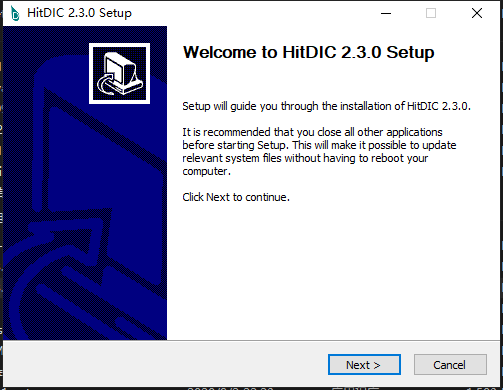

.. _reference-installer-pc:
# Installation of HitDIC PC

Firstly, download HitDIC installer from [HitDIC home page](https://hitdic.com) and install it.

Secondly, install `gnuplot` from [gnuplot download page](http://www.gnuplot.info/download.html) in order to enable the backend for plotting figures in HitDIC. Run the installer and add the installation directory of `gnuplot` to the system evironment variable.

