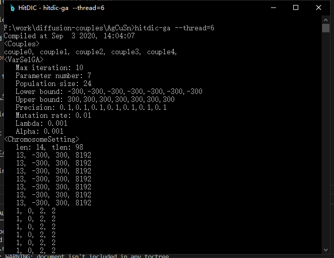
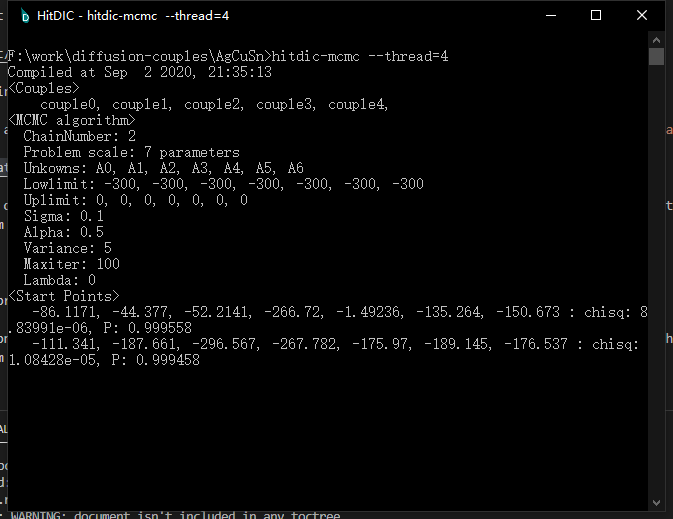

# Quick start with HitDIC

It is supposed that HitDIC toolkits are installed and a HitDIC project is prepared. If you are new to HitDIC and example project is available here [HitDIC example: fcc AgCuSn](_static/AgCuSn.zip).

First of all, start HitDIC command line environment.

Once the HitDIC installer is finished, a shortcut might be created on the Desktop. In order to open the command line environment for HitDIC, one might just click on the shortcut and the command line will be promted, i.e.,

### Step 1. Change the working directory to the folder of HitDIC project

Assuming that the path to HitDIC project is `F:/work/diffusion-couples/AgCuSn`, one might change the working directory via,

**Warning** When directing to a extern disk execpt `C:`, i.e., `F:`, one might change the directory to `F:` by entering it in the command line. Once the working directory is changed to `F:`, one might `cd F:/path/to/hitdic-project`.

### Step 2. Simulate the diffusion couples

Hit `hitdicplot` in the command line and the program will simulate all the diffusion couples. 

Results files are available in the `.cache` folder.

#### Optional visualization backend: Visualize composition profiles with `gnuplot`

`hitdicview` helps user to plot the composition profiles with `gnuplot`.

### Step 3. Optimization

#### Option 1: Run the genetic algorithm minimizer

`hitdic-ga` is responsible for activating the minimizer of genetic algorithm. It is worthy of mentioning that `--thread` can be used to specified the number of threads to be used.

#### Option 2: Run the MCMC sampler

`hitdic-mcmc` is responsible for activating the MCMC sampler.  It is worthy of mentioning that `--thread` can be used to specified the number of threads to be used.

Once the sampler is finished, one might simulate the composition profiles with `hitdicplot --latest`. In that case, the `hitdicplot` will load the latest optimization result, plot the results and ouput them in the `.cache` folder.

### Step 4: Get the results

Run `hitdicplot --latest --interd`, and you might find the data for in the `.cache` folder, i.e., `couplename_siminterd.csv` or `couplename_expinterd.csv`.

